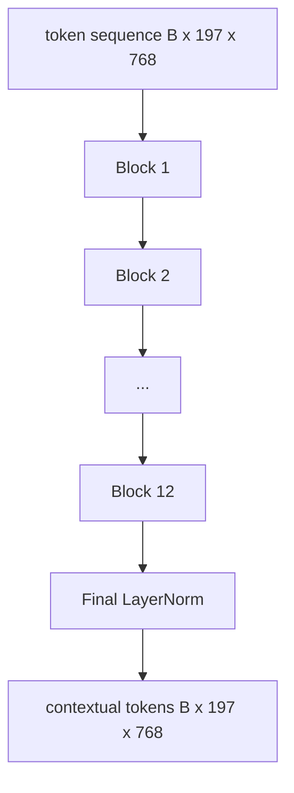
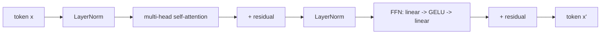

# Vision Transformer Encoder

> Patches alone do not see. A 12-layer pre-LN transformer with 12 attention heads turns patch tokens into contextual tokens.

**Type:** Build
**Languages:** Python
**Prerequisites:** Phase 19 lessons 30-37
**Time:** ~90 minutes

## Learning Objectives

- Implement a pre-LN transformer block with multi-head self-attention and feed-forward sub-layer.
- Stack 12 blocks with 12 heads to form a ViT-Base encoder.
- Wire the patch front end from lesson 58 into the encoder.
- Verify that the CLS token aggregates information from every patch.

## The Concept

### Parameter count at ViT-Base

| Component | Parameters |
|-----------|------------|
| qkv projection per block | 1.77M |
| output projection per block | 590K |
| FFN per block (4x) | 4.72M |
| Total | ~86M |

## Build It

`code/main.py` implements: `MultiHeadSelfAttention`, `FeedForward`, `Block`, `ViT`, `VisionEncoder`.

## Key Terms

| Term | What it means |
|------|---------------|
| Pre-LN | LayerNorm before each sub-layer instead of after |
| Self-attention | Each token attends to every other token |
| Multi-head | Hidden dim split across H independent heads |
| FFN expansion | Feed-forward widens to 4 * hidden before contracting |
| CLS pooling | First token's final state as image summary |

[Reference](https://github.com/rohitg00/ai-engineering-from-scratch/tree/main/phases/19-capstone-projects/59-vit-transformer)
