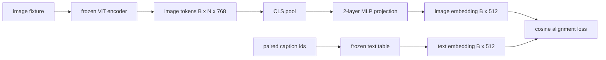

# Projection Layer for Modality Alignment

> A vision encoder produces image tokens. A text decoder consumes text tokens. A small two-layer MLP projects image tokens into the text embedding space.

**Type:** Build
**Languages:** Python
**Prerequisites:** Phase 19 lessons 30-37
**Time:** ~90 minutes

## Learning Objectives

- Build a two-layer MLP projection from image features to text embedding space.
- Construct a mock text embedding table.
- Compute a cosine alignment loss between projected image tokens and paired caption embedding.
- Train the projection alone with frozen vision encoder and text table.

## The Concept

### Why two layers and not one

A single linear layer can rotate and rescale but cannot fix basis curvature mismatches. GELU between two linear layers gives one non-linear bend, empirically enough for alignment.

| Layer | Shape | Parameters |
|-------|-------|------------|
| fc1 | (768, 1024) | 768*1024 + 1024 |
| activation | GELU | 0 |
| fc2 | (1024, 512) | 1024*512 + 512 |

## Build It

`code/main.py` implements: `MLPProjector`, `MockTextEmbedding`, `make_pair`, `cosine_alignment_loss`.

## Key Terms

| Term | What it means |
|------|---------------|
| Modality alignment | Making image and text embeddings comparable in one shared space |
| Projection head | Small module mapping one space to another, usually 2-layer MLP |
| Cosine similarity | Dot product divided by product of L2 norms |
| Frozen encoder | Vision/text model with requires_grad=False |

[Reference](https://github.com/rohitg00/ai-engineering-from-scratch/tree/main/phases/19-capstone-projects/60-projection-layer-modality-align)
