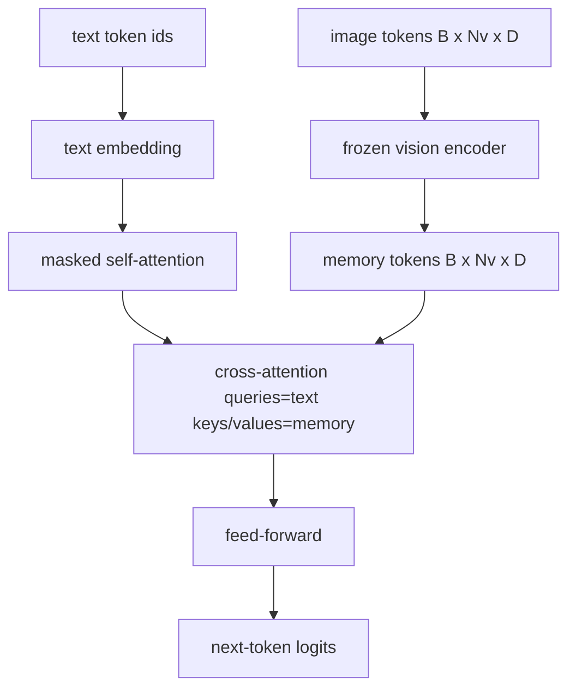

# Cross-Attention Fusion

> The projection layer aligns one image vector with one caption vector. Cross-attention lets every text token attend to every patch token.

**Type:** Build
**Languages:** Python
**Prerequisites:** Phase 19 lessons 30-37
**Time:** ~90 minutes

## Learning Objectives

- Implement multi-head cross-attention with query = text, key/value = vision.
- Compose a decoder block: causal self-attention + cross-attention + feed-forward.
- Get the mask shapes right: causal for self, none for cross.
- Run a forward pass with batched text tokens and fixed image tokens.

## The Concept

### Mask shapes

| Attention | Query length | Key length | Mask |
|-----------|--------------|------------|------|
| Self-attention | Nt (text) | Nt (text) | Causal lower-triangular |
| Cross-attention | Nt (text) | Nv (vision) | No mask |

## Build It

`code/main.py` implements: `CrossAttention`, `CausalSelfAttention`, `DecoderBlock`, `VisionLanguageDecoder`, `causal_mask`.

## Key Terms

| Term | What it means |
|------|---------------|
| Late fusion | Text and vision stay separate; cross-attention bridges at every block |
| Cross-attention | Q from one stream, K and V from another |
| Causal mask | Lower-triangular boolean preventing lookahead |
| KV cache | Image keys/values stored once, reused for every decode step |
| Memory tokens | Frozen image tokens the decoder reaches into |

[Reference](https://github.com/rohitg00/ai-engineering-from-scratch/tree/main/phases/19-capstone-projects/61-cross-attention-fusion)
