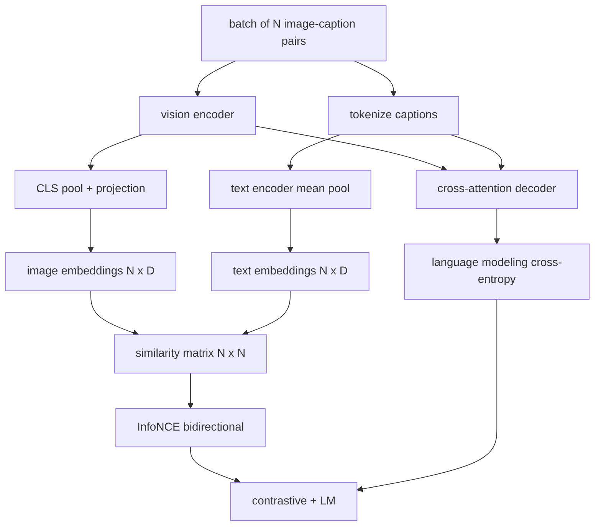

# Vision-Language Pretraining

> The encoder, projection, and decoder are wired. Now train them together: contrastive image-text loss plus language modeling loss.

**Type:** Build
**Languages:** Python
**Prerequisites:** Phase 19 lessons 30-37
**Time:** ~90 minutes

## Learning Objectives

- Implement InfoNCE contrastive loss across a batch of image-caption pairs.
- Compose contrastive loss with autoregressive language modeling loss.
- Synthesize a 200-pair mock corpus.
- Run a 50-step demo and observe both losses decreasing.

## The Concept

### InfoNCE

L2-normalize image and text embeddings. Compute N x N similarity matrix `S = I T^T / tau`. Cross-entropy with diagonal as target, symmetric across rows and columns.

### Combining losses

`total = contrastive + lm_weight * lm`

| Component | Loss surface | Affects |
|-----------|--------------|---------|
| InfoNCE | Pair ranking | Encoder + projection + text head |
| LM | Token prediction | Encoder + projection + decoder |

## Build It

`code/main.py` implements: `MultimodalModel`, `info_nce_loss`, `lm_loss`, `make_mock_corpus`, training loop.

## Key Terms

| Term | What it means |
|------|---------------|
| InfoNCE | Noise contrastive estimation: cross-entropy on similarity matrix |
| Temperature | Scalar controlling softmax peakiness |
| LM loss | Next-token cross-entropy on captioning side |
| Joint embedding space | Shared space for image and text vectors after projection |

[Reference](https://github.com/rohitg00/ai-engineering-from-scratch/tree/main/phases/19-capstone-projects/62-vision-language-pretraining)
