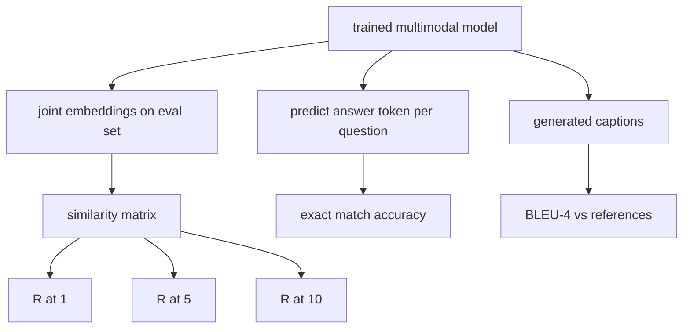

# Multimodal Evaluation

> Training is half the loop. The other half is measurement. Build three eval surfaces: retrieval R@K, VQA exact match, and BLEU-4 captioning.

**Type:** Build
**Languages:** Python
**Prerequisites:** Phase 19 lessons 58-62
**Time:** ~90 minutes

## Learning Objectives

- Compute Recall@K from a similarity matrix between image and caption embeddings.
- Compute exact-match VQA accuracy.
- Compute BLEU-4 from scratch.
- Run all three evals against a synthetic suite.

## The Concept

### Metric baselines (N=50)

| Metric | Range | Random baseline |
|--------|-------|----------------|
| R@1 | 0 to 1 | 0.02 |
| R@5 | 0 to 1 | 0.10 |
| R@10 | 0 to 1 | 0.20 |
| VQA EM | 0 to 1 | 1/vocab |
| BLEU-4 | 0 to 1 | small but nonzero |

## Build It

`code/main.py` implements: `recall_at_k`, `vqa_exact_match`, `bleu4`, `build_eval_suite`, `evaluate`.

## Key Terms

| Term | What it means |
|------|---------------|
| R@K | Fraction of queries where correct match lands in top K |
| Exact match | Predicted answer equals reference |
| BLEU-4 | Geometric mean of 1- to 4-gram precisions with brevity penalty |
| Multi-reference | Several reference captions per image |

[Reference](https://github.com/rohitg00/ai-engineering-from-scratch/tree/main/phases/19-capstone-projects/63-multimodal-eval)
