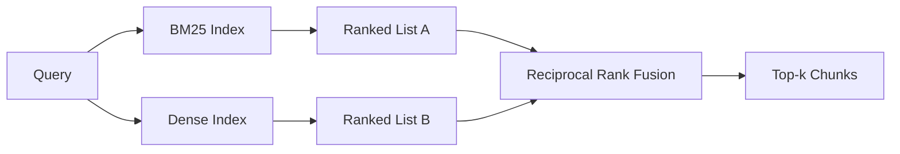

# Hybrid Retrieval with BM25 and Dense Embeddings

> Lexical and semantic retrieval fail on opposite query distributions. Hybrid retrieval with RRF votes, and the vote wins on every query class.

**Type:** Build
**Languages:** Python
**Prerequisites:** Phase 11 lessons 04, 06; Phase 19 Track B foundations; lesson 64
**Time:** ~90 minutes

## Learning Objectives

- Implement BM25 from scratch with field weighting, length normalization, and tunable k1, b.
- Build a dense retriever with deterministic mock embedding.
- Implement reciprocal rank fusion exactly as published.
- Tune the RRF k constant and per-modality weights.

## The Concept



### RRF formula

```
score(c) = sum over rankers of 1 / (k + rank(c))
```

Default k = 60. Per-modality weights multiply the rank contribution.

## Tuning knobs

| Knob | Default | Move up when | Move down when |
|------|---------|-------------|----------------|
| BM25 k1 | 1.5 | Terms repeat in documents | Documents are short |
| BM25 b | 0.75 | Long documents say less per word | Length uncorrelated with topic |
| RRF k | 60 | Deep candidates should vote | Top-1 should dominate |

## Build It

`code/main.py` implements: `tokenize`, `BM25Index`, `mock_embed`, `DenseIndex`, `rrf`, `HybridRetriever`.

## Key Terms

| Term | What it actually means |
|------|------------------------|
| BM25 | Probabilistic ranking with idf x saturating tf x length normalization |
| RRF | Sum of 1/(k + rank) across ranked lists |
| k1 | TF saturation control |
| b | Length penalty (0 = ignore, 1 = full) |

[Reference](https://github.com/rohitg00/ai-engineering-from-scratch/tree/main/phases/19-capstone-projects/65-hybrid-retrieval-bm25-dense)
