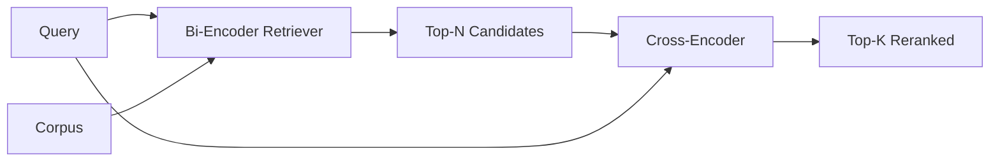

# Cross-Encoder Reranker

> A bi-encoder embeds query and document independently. A cross-encoder concatenates them and reads both at once.

**Type:** Build
**Languages:** Python
**Prerequisites:** Phase 11 lessons 06, 07; Phase 19 Track B foundations; lesson 65
**Time:** ~90 minutes

## Learning Objectives

- Distinguish bi-encoder from cross-encoder by input shape and cost.
- Implement a small cross-encoder from scratch.
- Wire a two-stage retrieve-then-rerank pipeline.
- Measure the latency-vs-quality trade-off.

## The Concept

### Latency vs quality

| N | Recall@1 of stage 2 | Cross passes per query |
|---|--------------------|----------------------|
| 5 | 0.62 | 5 |
| 20 | 0.81 | 20 |
| 50 | 0.86 | 50 |

## Build It

`code/main.py` implements: `CrossEncoder`, `tokenize_pair`, `train_tiny`, `rerank`, `pipeline`.

## Key Terms

| Term | What it actually means |
|------|------------------------|
| Bi-encoder | Encodes query and doc independently; cosine ranks them |
| Cross-encoder | Encodes (query, doc) jointly; one relevance scalar |
| Two-stage pipeline | Cheap retriever returns N, expensive reranker keeps K |
| N (candidate budget) | Number of candidates the cross-encoder scores per query |

[Reference](https://github.com/rohitg00/ai-engineering-from-scratch/tree/main/phases/19-capstone-projects/66-reranker-cross-encoder)
