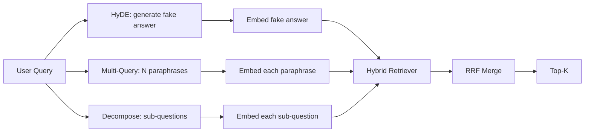

# Query Rewriting: HyDE, Multi-Query, and Decomposition

> The query the user types is not the query your retriever wants. Rewriting bridges the gap before retrieval.

**Type:** Build
**Languages:** Python
**Prerequisites:** Phase 11 lessons 04, 06; Phase 19 Track B foundations; lessons 64, 65
**Time:** ~90 minutes

## Learning Objectives

- Implement HyDE: generate a fake answer, embed that, retrieve against that vector.
- Implement multi-query expansion: N paraphrases, retrieve each, merge by RRF.
- Implement query decomposition: split into sub-questions, retrieve per sub-question.
- Compare the three rewriters head to head on a fixture.

## The Concept

## Build It

`code/main.py` implements: `MockLLM`, `HyDERewriter`, `MultiQueryRewriter`, `DecomposeRewriter`, `retrieve_with_rewriter`.

## Key Terms

| Term | What it actually means |
|------|------------------------|
| HyDE | LLM writes the answer; embed and retrieve on that instead of the query |
| Multi-query | N rewrites of the query; retrieve N times, merge by RRF |
| Decomposition | Multi-topic queries split into sub-questions, retrieved separately |
| Atomic query | Cannot be decomposed without inventing fake sub-questions |

[Reference](https://github.com/rohitg00/ai-engineering-from-scratch/tree/main/phases/19-capstone-projects/67-query-rewriting-hyde)
