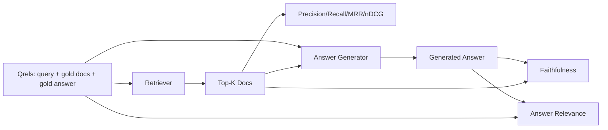

# RAG Evaluation: Precision, Recall, MRR, nDCG, Faithfulness, Answer Relevance

> If you cannot grade your retrieval and your answer at the same time, you cannot ship the system.

**Type:** Build
**Languages:** Python
**Prerequisites:** Phase 11 lessons 06, 10; Phase 19 Track B foundations; lessons 64-67
**Time:** ~90 minutes

## Learning Objectives

- Compute retrieval metrics: precision@k, recall@k, MRR, nDCG@k.
- Compute answer-grade metrics: faithfulness and answer relevance.
- Build a fixture qrels file.
- Diagnose pipeline failures from metric values.

## The Concept

### Diagnostic table

| Symptom | Likely cause |
|---------|-------------|
| Low recall, low precision | Chunker or retriever |
| Decent recall, low MRR | Reranker needed |
| High MRR, low faithfulness | Generator invents content |
| High faithfulness, low relevance | Query rewriter or generation prompt |

## Build It

`code/main.py` implements: `precision_at_k`, `recall_at_k`, `mean_reciprocal_rank`, `ndcg_at_k`, `extract_claims`, `faithfulness`, `answer_relevance`, `MockJudge`, `evaluate_pipeline`.

## Key Terms

| Term | What it actually means |
|------|------------------------|
| Precision@k | Fraction of top-k that are gold |
| Recall@k | Fraction of gold in top-k |
| MRR | Mean of 1/rank of first relevant document |
| nDCG@k | DCG divided by ideal DCG |
| Faithfulness | Fraction of claims supported by retrieved context |
| Answer relevance | Whether the answer matches the question's intent |

[Reference](https://github.com/rohitg00/ai-engineering-from-scratch/tree/main/phases/19-capstone-projects/68-rag-eval-precision-recall)
