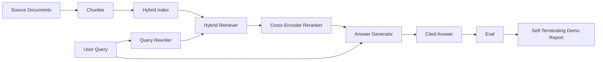

# End-to-End RAG System

> Six lessons of components. One pipeline. One eval loop. One self-terminating demo.

**Type:** Build
**Languages:** Python
**Prerequisites:** Phase 11 lessons 06, 10; Phase 19 Track B foundations; lessons 64-68
**Time:** ~90 minutes

## Learning Objectives

- Compose chunker, hybrid retriever, query rewriter, cross-encoder reranker, and answer generator.
- Implement an answer generator that cites claims by chunk anchor.
- Run the lesson 68 eval against the assembled pipeline.
- Build a self-terminating CLI demo.

## The Concept

### Stage interfaces

| Stage | Input | Output |
|-------|-------|--------|
| Chunker | Document text | List of Chunk records |
| Retriever | Query string | Top-N Chunks |
| Rewriter | Query string | List of rewrites |
| Reranker | Query, candidates | Top-K Chunks with scores |
| Generator | Query, top-K Chunks | Answer with citations |

## Build It

`code/main.py` implements: `Chunk`, `Chunker`, `HybridIndex`, `Rewriter`, `Reranker`, `Generator`, `Pipeline`, `run_demo`.

## Key Terms

| Term | What it actually means |
|------|------------------------|
| Pipeline | Composed stages from ingestion to cited answer |
| Citation anchor | (doc_id, chunk_index) reference per claim |
| Refuse-on-low-confidence | Generator returns "I do not know" when reranker top-1 is below threshold |
| Smoke set | Minimal qrels subset running in every PR check |

[Reference](https://github.com/rohitg00/ai-engineering-from-scratch/tree/main/phases/19-capstone-projects/69-end-to-end-rag-system)
