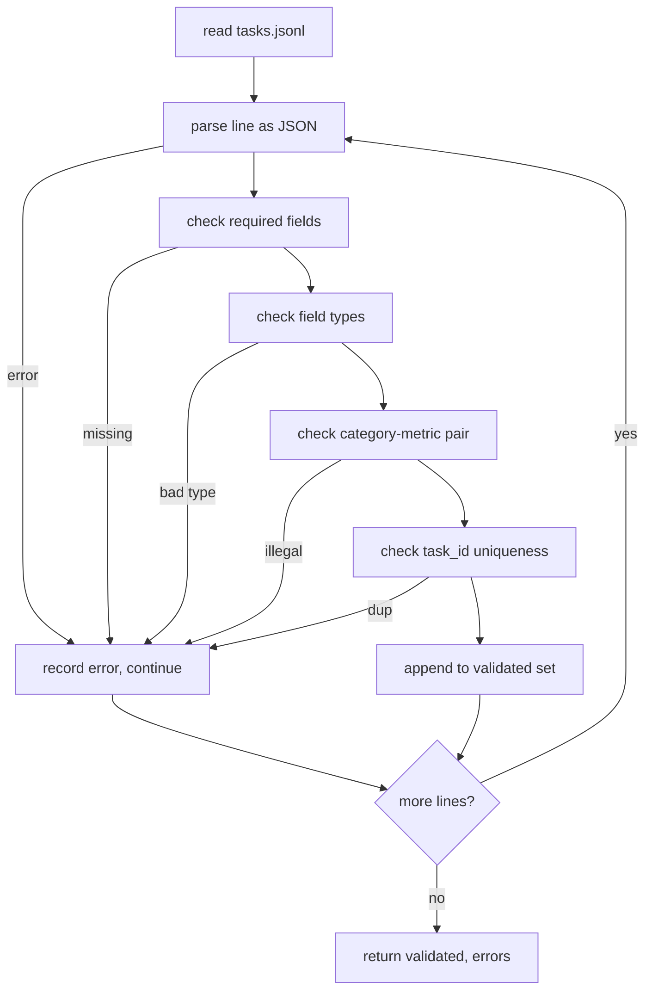

# Task Spec Format

> An eval harness is only as good as the contract its tasks honour. Freeze the JSONL shape and metric vocabulary before you write a single scoring function.

**Type:** Build
**Languages:** Python
**Prerequisites:** Phase 19 Track B foundations
**Time:** ~90 min

## Learning Objectives

- Define a JSONL task record schema covering arithmetic, MCQ, code exec, classification, and summarisation.
- Pin a closed vocabulary of metric names.
- Specify few-shot examples and post-processing rules as part of the task.
- Implement a strict validator that rejects malformed records.
- Ship a 10-task fixture set.

## The record shape

```json
{
  "task_id": "arith_001",
  "category": "arithmetic",
  "prompt": "Compute. Question: 17 + 24\nAnswer:",
  "targets": ["41"],
  "metric_name": "exact_match",
  "few_shot_examples": [
    {"prompt": "Question: 2 + 2\nAnswer:", "completion": "4"}
  ],
  "post_process": "strip_whitespace",
  "metadata": {"difficulty": "easy"}
}
```

## Validator behaviour



## Build It

`main.py` defines `TaskSpec`, `validate_task`, `validate_file`, `render`, and post-process helpers.

## Key Terms

| Term | What it actually means |
|------|------------------------|
| Task spec | JSONL with prompt, targets, metric_name, post_process |
| Metric vocabulary | Closed set: exact_match, f1, bleu_4, rouge_l, accuracy, code_exec |
| Post-process | Deterministic: none, strip_whitespace, lower, extract_letter, etc. |
| Few-shot rendering | Concatenate examples before prompt with blank line separator |

[Reference](https://github.com/rohitg00/ai-engineering-from-scratch/tree/main/phases/19-capstone-projects/70-task-spec-format)
