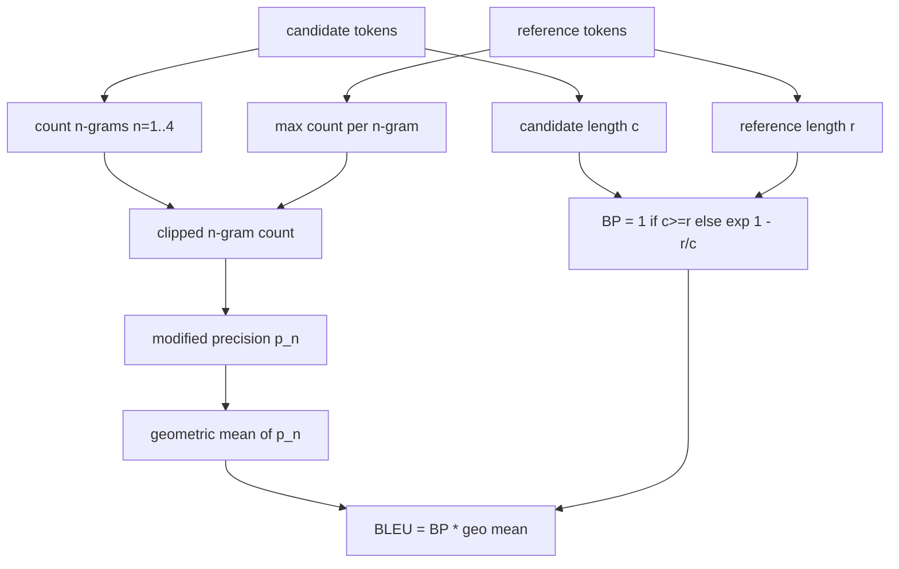

# Classical Metrics

> BLEU, ROUGE-L, F1, exact-match, accuracy. Implement each from first principles so you know what the number means.

**Type:** Build
**Languages:** Python
**Prerequisites:** Phase 19 Track B foundations, lesson 70
**Time:** ~90 min

## Learning Objectives

- Implement exact-match, F1, and accuracy with explicit tokenisation.
- Implement BLEU-4 from the ground up.
- Implement ROUGE-L using longest common subsequence.
- Dispatch on metric_name from lesson 70.
- Pin behaviour with reference vectors.

## Tokenisation

```python
TOKEN_RE = re.compile(r"\w+", re.UNICODE)
def tokenize(text):
    return TOKEN_RE.findall(text.lower())
```

## BLEU-4



## ROUGE-L

Longest common subsequence via DP, then recall, precision, and F1.

## Dispatch contract

```python
def score(metric_name, pred, targets):
    if metric_name == "exact_match": return exact_match(pred, targets)
    if metric_name == "f1": return max(f1_score(pred, t) for t in targets)
    if metric_name == "bleu_4": return max(bleu4(pred, t) for t in targets)
    if metric_name == "rouge_l": return max(rouge_l(pred, t) for t in targets)
    if metric_name == "accuracy": return accuracy(pred, targets)
```

## Build It

`main.py` defines each metric as a free function plus the dispatcher.

## Key Terms

| Term | What it actually means |
|------|------------------------|
| Modified precision | Clipped n-gram count prevents repetition inflation |
| Brevity penalty | Penalizes candidates shorter than reference |
| LCS | Longest common subsequence captures word order without forcing contiguity |
| Smoothing | Add-one to avoid log(0) on missing n-grams |

[Reference](https://github.com/rohitg00/ai-engineering-from-scratch/tree/main/phases/19-capstone-projects/71-classical-metrics)
