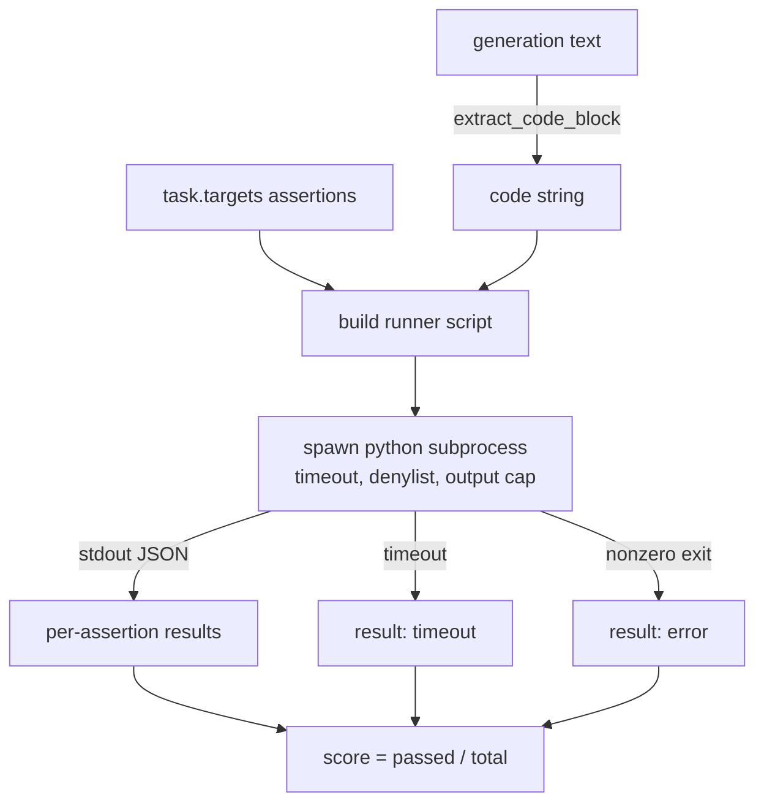

# Code Exec Metric

> Generated code is right when it passes the tests. The eval harness extracts code, runs it without crashing the host, and tallies pass-rates.

**Type:** Build
**Languages:** Python
**Prerequisites:** Phase 19 Track B foundations, lessons 70, 71
**Time:** ~90 min

## Learning Objectives

- Extract a code block from free-form generation.
- Execute candidate code in an isolated subprocess with timeout and output cap.
- Score a task as fraction of assertions that pass.
- Compute pass-at-k for multiple generation samples.
- Treat sandbox crashes, syntax errors, and timeouts as first-class fail modes.

## The shape of a code-exec task



## Pass-at-k

```
pass_at_k(n, c, k) = 1 - C(n - c, k) / C(n, k)
```

## Exit codes

- `pass`: all assertions passed
- `assertion_fail`: code ran but at least one assertion failed
- `syntax_error`: code did not import or had SyntaxError
- `timeout`: wall clock expired
- `error`: any other crash including denylist hits

## Build It

`main.py` defines `extract_code`, `run_candidate`, `score_code_exec`, and `pass_at_k`.

## Key Terms

| Term | What it actually means |
|------|------------------------|
| Denylist | Import-based blocking of dangerous modules (os.system, subprocess, socket, etc.) |
| Wall-clock timeout | subprocess.run(timeout=t), 3s default, configurable per task |
| Output cap | 256 KB limit; kills child if exceeded |
| Pass-at-k | Unbiased estimator from n samples with c passing |

[Reference](https://github.com/rohitg00/ai-engineering-from-scratch/tree/main/phases/19-capstone-projects/72-code-exec-metric)
