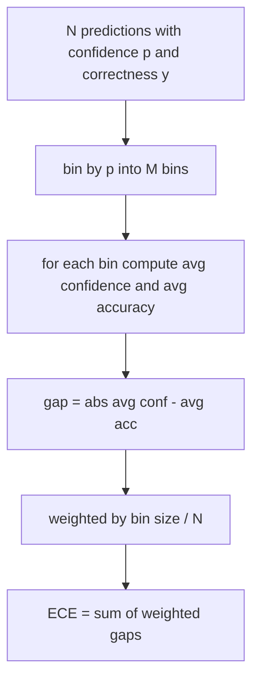

# Perplexity and Calibration

> If your model says 90% confident on a thousand answers and gets six hundred right, it is not well calibrated.

**Type:** Build
**Languages:** Python
**Prerequisites:** Phase 19 Track B foundations, lessons 70, 71
**Time:** ~90 min

## Learning Objectives

- Compute token-level perplexity from negative log-probabilities.
- Compute expected calibration error (ECE) from binned confidences.
- Compute Brier score and its decomposition.
- Build reliability diagram data.
- Wire all three into the eval harness.

## Perplexity

```python
def perplexity(neg_log_probs, token_counts):
    total_nll = sum(neg_log_probs)
    total_tokens = sum(token_counts)
    return math.exp(total_nll / total_tokens)
```

## Expected calibration error



## Brier score

```python
def brier(p, y):
    return float(np.mean((p - y) ** 2))
```

## Build It

`main.py` defines `perplexity`, `expected_calibration_error`, `brier_score`, `reliability_diagram`, `CalibrationReport`, `PerplexityResult`.

## Key Terms

| Term | What it actually means |
|------|------------------------|
| Perplexity | Exponentiated average negative log-likelihood per token |
| ECE | Average gap between confidence and accuracy across bins |
| Brier score | Mean squared error between confidence and outcome |
| Reliability diagram | Plot of predicted confidence vs empirical accuracy per bin |

[Reference](https://github.com/rohitg00/ai-engineering-from-scratch/tree/main/phases/19-capstone-projects/73-perplexity-calibration)
