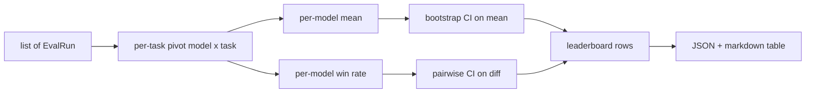

# Leaderboard Aggregation

> Per-task scores are easy. Per-model rankings across heterogeneous tasks are harder. Statistical significance is the part everyone skips.

**Type:** Build
**Languages:** Python
**Prerequisites:** Phase 19 Track B foundations, lessons 70, 71, 73
**Time:** ~90 min

## Learning Objectives

- Aggregate per-task scores into per-model rows.
- Normalise heterogeneous scores into [0, 1].
- Rank models by mean and win-rate.
- Compute bootstrap confidence intervals.
- Output leaderboard as JSON and markdown.

## The shape of input

```python
@dataclass
class EvalRun:
    model_id: str
    task_id: str
    metric_name: str
    score: float
    category: str
```

## The output



## Bootstrap CI

Resample tasks with replacement B times, compute mean each time, take alpha/2 and 1-alpha/2 percentiles.

## Build It

`main.py` defines `EvalRun`, `LeaderboardRow`, `aggregate`, `bootstrap_mean_ci`, `bootstrap_pairwise_diff`, `render_markdown`.

## Key Terms

| Term | What it actually means |
|------|------------------------|
| Win-rate | Fraction of tasks where model beats all others |
| Bootstrap | Resample with replacement for CI estimation |
| Pairwise diff | Bootstrap CI of per-task score_A - score_B |
| Per-category mean | Mean score within each category |

[Reference](https://github.com/rohitg00/ai-engineering-from-scratch/tree/main/phases/19-capstone-projects/74-leaderboard-aggregation)
