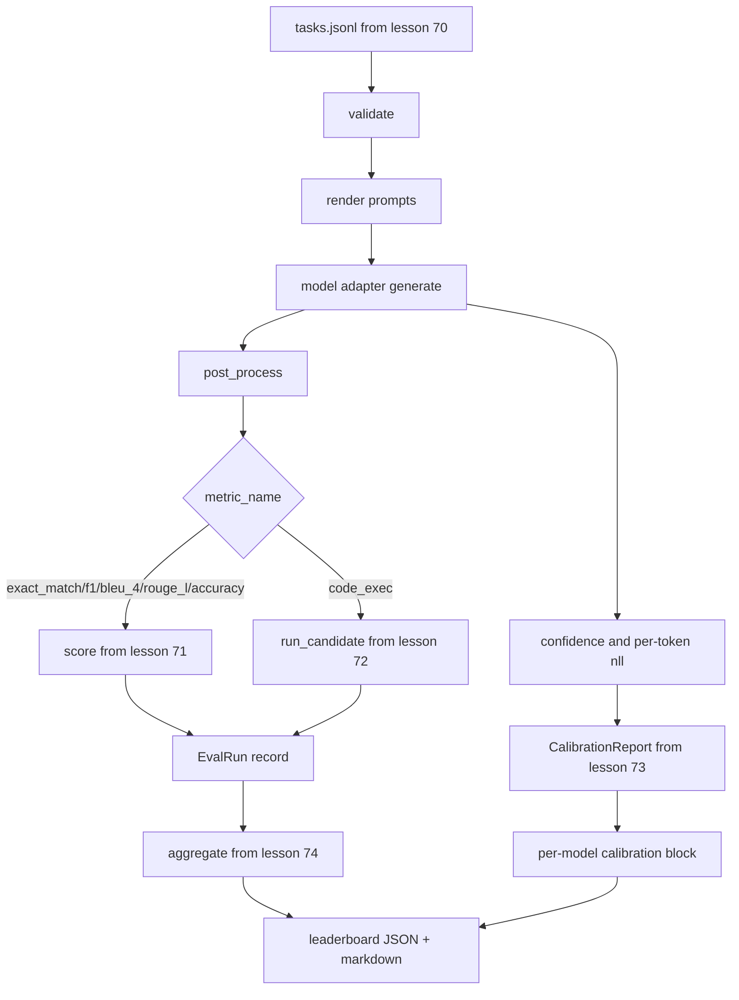

# End-to-End Eval Runner

> Five lessons of plumbing, one lesson to glue them. The runner reads tasks, calls a model adapter, scores, attaches calibration, emits a leaderboard.

**Type:** Build
**Languages:** Python
**Prerequisites:** Phase 19 Track B foundations, lessons 70-74
**Time:** ~90 min

## Learning Objectives

- Define a ModelAdapter interface for any model.
- Run the eval over a fixture JSONL with parallel task execution.
- Compose metric layer with calibration layer in one pass.
- Emit EvalRun records for the leaderboard aggregator.
- Output JSON report and markdown table.

## The pipeline

## Build It

`main.py` is the integration. Imports from lessons 70-74. Mock adapters: `RuleBasedAdapter`, `NoisyAdapter`, `BiasedAdapter`.

## Key Terms

| Term | What it actually means |
|------|------------------------|
| ModelAdapter | Interface with generate(prompt, task) -> Generation |
| Generation | text + confidence + optional token_nll and token_count |
| Calibration buffer | Accumulates (confidence, correct) pairs across tasks |

[Reference](https://github.com/rohitg00/ai-engineering-from-scratch/tree/main/phases/19-capstone-projects/75-end-to-end-eval-runner)
