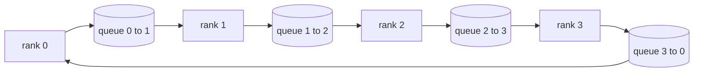

# Collective Ops From Scratch

> The four collective operations that hold distributed training together: allreduce, broadcast, allgather, reduce_scatter.

**Type:** Build
**Languages:** Python
**Prerequisites:** Phase 19 Track C lessons 42-49
**Time:** ~90 min

## Learning Objectives

- Implement ring allreduce in two passes (reduce-scatter then allgather).
- Build broadcast, allgather, and reduce_scatter over multiprocessing.Queue.
- Verify every primitive against gloo reference.
- Defend ring vs tree on cluster shape and latency.

## The Concept

### Primitive comparison

| Primitive | Per-rank bytes | Steps |
|-----------|---------------|-------|
| Ring allreduce | 2T(N-1)/N | 2(N-1) |
| Tree allreduce | T log2(N) | 2 log2(N) |
| Broadcast | T | log2(N) |
| Allgather | T(N-1)/N | N-1 |
| Reduce_scatter | T(N-1)/N | N-1 |

## Build It

`code/main.py` implements: `Mesh`, `ring_allreduce`, `broadcast`, `allgather`, `reduce_scatter`, `_gloo_reference`.

## Key Terms

| Term | What it actually means |
|------|------------------------|
| Allreduce | Sum across ranks, every rank holds the reduced tensor |
| Ring | N-1 chunks of size T/N flow around the cycle twice |
| Tree | Reduction follows binary tree, depth log2(N) |
| Allgather | Every rank ends with every other rank's shard |
| Reduce_scatter | Each rank ends with sum of one chunk only |
| Bucket | Fuse N small allreduces into one large one |

[Reference](https://github.com/rohitg00/ai-engineering-from-scratch/tree/main/phases/19-capstone-projects/76-collective-ops-from-scratch)
