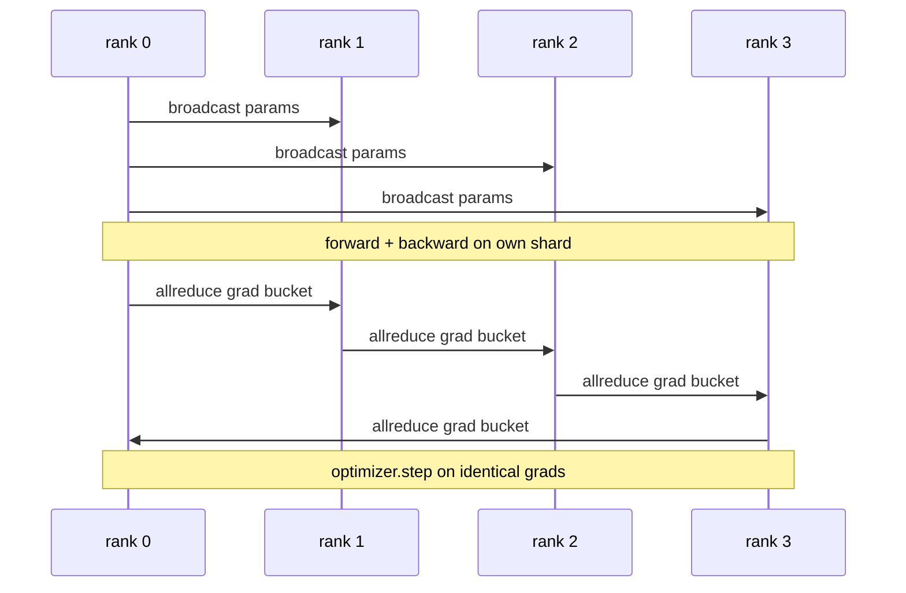

# Data Parallel DDP From Scratch

> DistributedDataParallel is a hook on top of allreduce. Broadcast parameters, install a backward hook, allreduce gradients, step.

**Type:** Build
**Languages:** Python
**Prerequisites:** Phase 19 Track C lessons 42-49
**Time:** ~90 min

## Learning Objectives

- Wire a DDP-shaped wrapper with broadcast and allreduce.
- Spawn N CPU ranks with gloo backend.
- Prove gradient-sync correctness against sequential baseline.
- Defend buckets and overlap as production improvements.

## The Concept

### The three operations DDP needs

| Stage | Collective | Why |
|-------|-----------|-----|
| Init | broadcast from rank 0 | Same starting parameters |
| After backward | allreduce of each grad | Mean gradient for optimizer |
| Sometimes | broadcast of buffers | Synced batchnorm stats |

## Build It

`code/main.py` implements: `MiniMLP`, `DistributedDataParallel`, `worker`, `_reference_single_process_loop`.

## Key Terms

| Term | What it actually means |
|------|------------------------|
| DDP | Wrapper that broadcasts params and allreduces grads each step |
| Bucket | Group N small allreduces into one large one |
| Overlap | Issue allreduce while later layers compute backward |
| no_sync | Skip post-backward allreduce for gradient accumulation |

[Reference](https://github.com/rohitg00/ai-engineering-from-scratch/tree/main/phases/19-capstone-projects/77-data-parallel-ddp)
