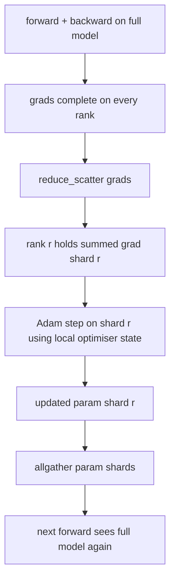

# ZeRO Optimizer State Sharding

> Adam stores two moment estimates per parameter. ZeRO stage 1 shards that across N ranks for a linear memory drop.

**Type:** Build
**Languages:** Python
**Prerequisites:** Phase 19 Track C lessons 42-49
**Time:** ~90 min

## Learning Objectives

- Shard optimiser state across N ranks so each owns 1/N.
- Use reduce_scatter + allgather for gradient delivery and param broadcast.
- Compute the memory savings table for ZeRO stages.
- Defend stage choice on model size and bandwidth.

## The Concept

### Memory math (P parameters, Adam, mixed precision)

| Term | Vanilla | ZeRO-1 |
|------|---------|--------|
| fp16 params | 2P | 2P |
| fp16 grads | 2P | 2P |
| fp32 master | 4P | 4P/N |
| fp32 moments | 8P | 8P/N |
| Total | 16P | 4P + 12P/N |

At N=8: 65% drop. At N=64: 74% drop.

## Build It

`code/main.py` implements: `flatten_params`, `unflatten_into`, `ZeroOptimizer`.

## Key Terms

| Term | What it actually means |
|------|------------------------|
| ZeRO-1 | Shard optimiser state only |
| ZeRO-2 | Shard gradients too |
| ZeRO-3 | Shard parameters (FSDP) |
| Master copy | fp32 parameter copy the optimiser updates |
| Reduce_scatter | Deliver each rank only its shard's summed gradient |

[Reference](https://github.com/rohitg00/ai-engineering-from-scratch/tree/main/phases/19-capstone-projects/78-zero-parameter-sharding)
