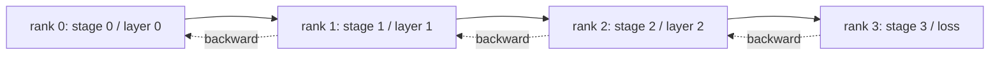

# Pipeline Parallel and Bubble Analysis

> Pipeline splits the model across ranks. Microbatches flow through. The empty time at start and end is the bubble.

**Type:** Build
**Languages:** Python
**Prerequisites:** Phase 19 Track C lessons 42-49
**Time:** ~90 min

## Learning Objectives

- Split a model into N stages and simulate forward pipeline.
- Schedule M microbatches with GPipe schedule and compute bubble fraction.
- Compare against 1F1B schedule.
- Defend equal compute per stage over equal parameter count.

## The Concept



### Bubble fraction (GPipe)

```
bubble = (N - 1) / (M + N - 1)
```

At M=8, N=4: 27%. At M=64, N=4: 4.5%.

### GPipe vs 1F1B

| Schedule | Forward | Backward | Activation memory |
|----------|---------|----------|-------------------|
| GPipe | All M forwards first | Then all backwards | O(M) |
| 1F1B | Interleaved F and B | Interleaved | O(depth) |

## Build It

`code/main.py` implements: `PipelineStage`, `Pipeline`, `bubble_fraction`.

## Key Terms

| Term | What it actually means |
|------|------------------------|
| Pipeline | One stage per rank, activations flow stage to stage |
| Bubble | (N-1) steps at start + end where some stages have no work |
| Microbatch | One forward/backward unit; bubble shrinks as M grows |
| GPipe | Fill then drain; high activation memory |
| 1F1B | Interleaved; bounded activation memory |

[Reference](https://github.com/rohitg00/ai-engineering-from-scratch/tree/main/phases/19-capstone-projects/79-pipeline-parallel)
