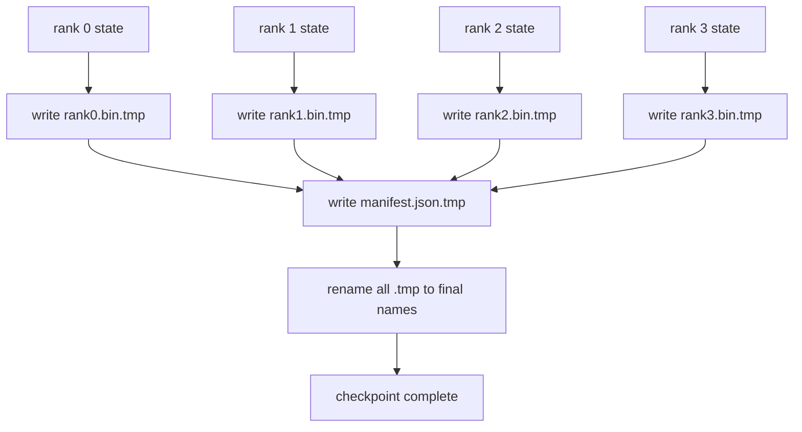

# Sharded Checkpoint and Atomic Resume

> A 70B training job fails every few hours. The checkpoint format decides whether you lose 30 minutes or 30 hours.

**Type:** Build
**Languages:** Python
**Prerequisites:** Phase 19 Track C lessons 42-49
**Time:** ~90 min

## Learning Objectives

- Save a multi-rank checkpoint as per-rank shard files plus manifest.
- Use atomic write pattern (temp then rename).
- Resume from manifest, verifying byte-equal state.
- Defend manifest schema against world-size change, shard mismatch, partial write.

## The Concept



### Manifest schema

```json
{
  "world_size": 4,
  "step": 1234,
  "wall_clock_seconds": 4521,
  "shards": [
    {"rank": 0, "path": "rank0.bin", "sha256": "...", "param_shard_offset": 0, "param_shard_numel": 65536}
  ],
  "schema_version": 1
}
```

### Failure mode defences

| Failure | Defence |
|---------|---------|
| World-size change | manifest mismatch, fail loudly |
| Shard count mismatch | enumerate and verify existence |
| Partial write | sha256 verification on load |

## Build It

`code/main.py` implements: `ShardManifest`, `save_sharded`, `load_sharded`, round-trip test.

## Key Terms

| Term | What it actually means |
|------|------------------------|
| Sharded checkpoint | Each rank writes its own shard file in parallel |
| Manifest | JSON with shard paths, offsets, sha256 |
| Atomic write | Write to .tmp then POSIX rename |
| Partial write | Truncated shard; sha256 catches it |
| Rotation | Keep last K checkpoints, delete oldest |

[Reference](https://github.com/rohitg00/ai-engineering-from-scratch/tree/main/phases/19-capstone-projects/80-checkpoint-sharded-resume)
