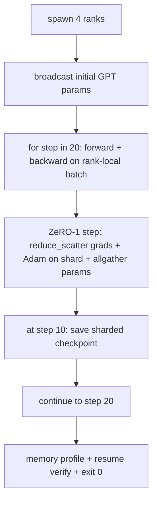

# End-to-End Distributed Training

> Six lessons of pieces. One assembly: DDP + ZeRO-1 + sharded checkpoint training a tiny GPT across 4 ranks.

**Type:** Build
**Languages:** Python
**Prerequisites:** Phase 19 Track C lessons 42-49
**Time:** ~90 min

## Learning Objectives

- Compose DDP + ZeRO-1 + sharded checkpoint into one training loop.
- Train a 2-layer transformer LM on synthetic corpus across 4 ranks.
- Print per-step loss, per-rank memory, and checkpoint manifest.
- Defend that each piece is independently testable.

## The Concept

### Composition rules

| Piece | Owns | Leaves to loop |
|-------|------|----------------|
| DDP broadcast | Initial param sync | One call at construct |
| ZeRO-1 | Gradient sync + master copy + param broadcast | One call per step |
| Sharded checkpoint | Persist per-rank state + manifest | Called on rank 0 |

## Build It

`code/main.py` implements: `MiniGPT` (2-layer transformer), `make_corpus`, `_train_worker`, `verify_resume`, `main`.

## Key Terms

| Term | What it actually means |
|------|------------------------|
| End-to-end | One run composes every piece, not a unit test per piece |
| Memory profile | Bytes per rank for params, grads, optimiser state |
| Resume contract | Per-rank state byte-equal after checkpoint round-trip |
| Self-terminating | Fixed step count, exit 0, no human in loop |

[Reference](https://github.com/rohitg00/ai-engineering-from-scratch/tree/main/phases/19-capstone-projects/81-end-to-end-distributed-train)
