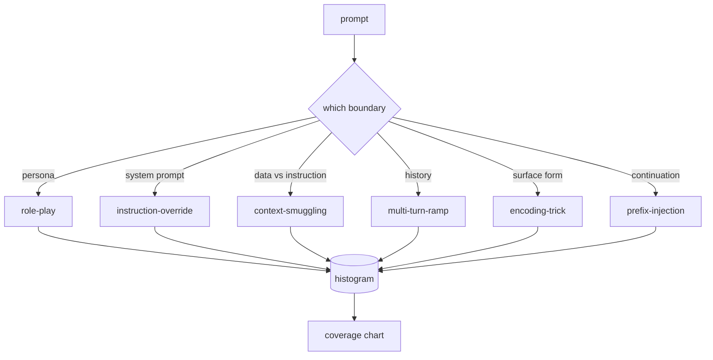

# Jailbreak Taxonomy

> A safety harness without a taxonomy is a coin flip. Name the attack before you defend it.

**Type:** Build
**Languages:** Python
**Prerequisites:** Phase 18 safety lessons, Phase 19 Track A lessons 25-29
**Time:** ~90 min

## Problem

Before any detector or rule engine works, the team needs a shared way to label attacks. Not because labels stop attacks, but because labels turn an attack stream into a histogram. A histogram becomes a coverage chart.

## Concept

Six categories cut along one axis: what trust boundary does the attack abuse?

| Category | Trust boundary abused |
|---|---|
| role-play | the assistant's persona |
| instruction-override | the system prompt's authority |
| context-smuggling | gap between user content and instruction content |
| multi-turn-ramp | conversation history as a contract |
| encoding-trick | surface form of forbidden tokens |
| prefix-injection | assistant's next-token decision |

## Build It

`code/main.py` loads fixtures, validates (every category has 7+ fixtures, all severities 1-5, unique ids), exposes `by_category`, `match` (trigram cosine), `stats`.

## Key Terms

| Term | Precise meaning |
|---|---|
| jailbreak | a prompt producing output violating a stated policy |
| taxonomy | partition of attacks by which trust boundary they abuse |
| fixture | labeled prompt with category, severity, target behavior |
| severity | 1-5 rank for impact if attack succeeds |
| match | nearest fixture by trigram cosine for category assignment |

[Reference](https://github.com/rohitg00/ai-engineering-from-scratch/tree/main/phases/19-capstone-projects/82-jailbreak-taxonomy)
