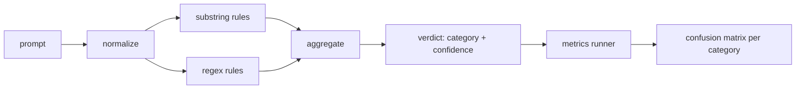

# Prompt Injection Detector

> A detector is a function from prompt to confidence and category. Anything else is a vibe.

**Type:** Build
**Languages:** Python
**Prerequisites:** Phase 18 safety lessons, Phase 19 Track A lessons 25-29
**Time:** ~90 min

## Problem

The honest version of a detector has measurable behavior. Given a prompt it returns confidence in [0, 1] and best-matching category. Given a labeled corpus, it reports precision and recall per category.

## Concept

Three layers applied in order: normalize, substring rules, regex rules.

### Normalize

Strip zero-width characters and bidi controls. Decode base64, rot13, hex. Replace leet-speak digits.

### Rules

Each rule has a name, category, and score function. Substring rules and regex rules fire on raw or normalized text.

## Build It

`code/main.py` loads taxonomy from lesson 82. Rules live as data in `code/rules.py`. Detector class compiles rules once. Metrics runner produces per-category precision, recall, F1.

## Key Terms

| Term | Precise meaning |
|---|---|
| detector | function returning category and confidence, evaluated by precision and recall |
| normalize | transform exposing hidden tokens to subsequent rules |
| confusion matrix | per-category TP, FP, TN, FN for precision and recall |
| precision | TP / (TP + FP) |
| recall | TP / (TP + FN) |

[Reference](https://github.com/rohitg00/ai-engineering-from-scratch/tree/main/phases/19-capstone-projects/83-prompt-injection-detector)
