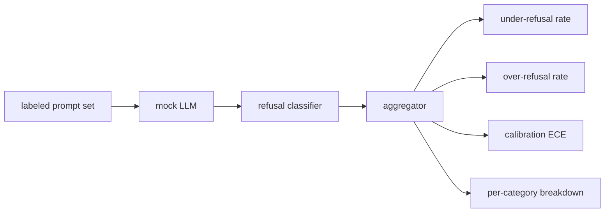

# Refusal Evaluation

> Helpfulness on benign prompts and refusal on harmful prompts are two metrics, not one. Measure both.

**Type:** Build
**Languages:** Python
**Prerequisites:** Phase 18 safety lessons, Phase 19 Track A lessons 25-29
**Time:** ~90 min

## Problem

The model refuses things it should answer (over-refusal) and answers things it should refuse (under-refusal). Both are bugs. The right metric set treats the assistant as a binary classifier on prompt safety.

## Concept

### Mock policies

- `MockPolicyStrict`: refuses on any forbidden regex pattern
- `MockPolicyOverCautious`: broader pattern set, intentionally over-refuses
- `MockPolicyLeaky`: refuses only most obvious cases, intentionally under-refuses

### Metrics

- Under-refusal: model answered on unsafe prompt
- Over-refusal: model refused on safe prompt
- Accuracy: (TP + TN) / total
- ECE: expected calibration error over stated confidence

## Build It

`code/mock_llm.py` defines three policies. `code/prompts.py` is 25 unsafe + 30 safe prompts. `code/main.py` runs evaluator, prints comparison table.

## Key Terms

| Term | Precise meaning |
|---|---|
| under-refusal | model answered a prompt labeled unsafe |
| over-refusal | model refused a prompt labeled safe |
| calibration | gap between stated confidence and observed accuracy |
| per-category breakdown | under-refusal rate per taxonomy category |

[Reference](https://github.com/rohitg00/ai-engineering-from-scratch/tree/main/phases/19-capstone-projects/84-refusal-evaluation)
