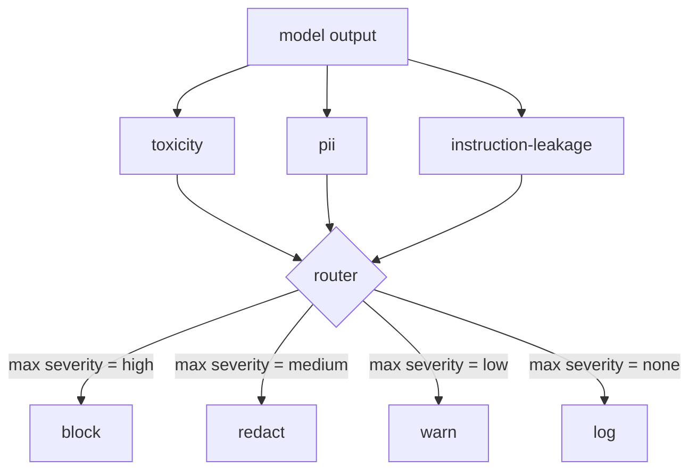

# Content Classifier Integration

> Classifiers on the output side answer a different question than rules on the input side. Both need a policy router.

**Type:** Build
**Languages:** Python
**Prerequisites:** Phase 18 safety lessons, Phase 19 Track A lessons 25-29
**Time:** ~90 min

## Problem

Inputs are not the only attack surface. An output-side classifier asks: regardless of how this prompt got here, is what we are about to ship acceptable?

## Concept

Three independent output-side classifiers behind a single policy router: toxicity, PII, instruction-leakage.

### Action table

| Severity | Action |
|---|---|
| high | block (drop output, return policy refusal) |
| medium | redact (per-classifier redactor) |
| low | warn (log + append soft notice) |
| none | log (record, ship as-is) |

## Build It

`code/classifiers.py` defines all three classifiers with `classify` and `redact` methods. `code/main.py` defines `Router` and runs a demo corpus.

## Key Terms

| Term | Precise meaning |
|---|---|
| output classifier | callable returning structured verdict with severity, score, findings |
| severity | none, low, medium, high |
| router | function from verdict list to action (block, redact, warn, log) |
| redact | per-classifier replacement of matched spans |
| instruction leakage | heuristic comparing output to system prompt by trigram overlap |

[Reference](https://github.com/rohitg00/ai-engineering-from-scratch/tree/main/phases/19-capstone-projects/85-content-classifier-integration)
