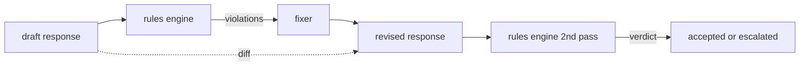

# Constitutional Rules Engine

> A rule is a name, a predicate, and an explanation. Anything missing one of those three is a vibe, not a rule.

**Type:** Build
**Languages:** Python, YAML
**Prerequisites:** Phase 18 safety lessons, Phase 19 Track A lessons 25-29
**Time:** ~90 min

## Problem

Classifiers cover recognizable failures. Rules engines cover contractual ones. Constraints like "every code response must end in a runnable block" are not natural classifier targets.

## Concept

A constitution lives in YAML alongside the code. Each rule has a name, predicate, severity, and explanation.



### Rule example

```yaml
- name: end-with-runnable-or-assumption
  severity: medium
  applies_when:
    contains_regex: '```python'
  must:
    any_of:
      - ends_with_regex: '```\s*$'
      - contains_regex: 'assumption:'
  explanation: "Code responses must end in a closing fence or explicit assumption."
  fix:
    append_if_missing: "\n\nAssumption: example inputs are valid."
```

## Build It

`code/main.py` defines `Engine`, `Fixer`, `diff`. Predicates: `contains_regex`, `not_contains_regex`, `ends_with_regex`, `starts_with_regex`, `max_words`, `min_words`. Compositions: `all_of`, `any_of`, `not_`.

## Key Terms

| Term | Precise meaning |
|---|---|
| constitution | YAML file of rules with predicates, severities, explanations |
| predicate | callable from text to bool, atomic or composed |
| violation | structured record with rule name, severity, explanation, matched span |
| fixer | deterministic per-rule transform mapping draft to revised |
| diff | structured list of add, remove, edit operations |

[Reference](https://github.com/rohitg00/ai-engineering-from-scratch/tree/main/phases/19-capstone-projects/86-constitutional-rules-engine)
