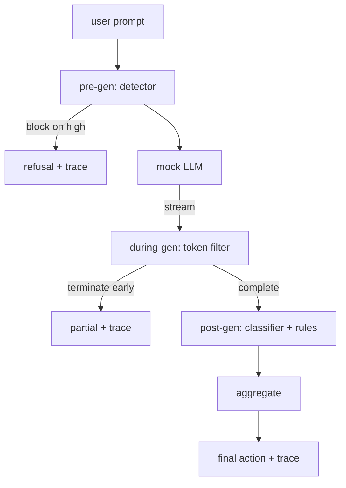

# End-to-End Safety Gate

> Pre-gen, during-gen, post-gen. Three checkpoints, one verdict, an audit trail per request.

**Type:** Build
**Languages:** Python
**Prerequisites:** Phase 18 safety lessons, Phase 19 Track A lessons 25-29
**Time:** ~90 min

## Problem

Lessons 82-86 each shipped a single piece. A real safety gate composes them at the right moment, decides action when they disagree, and produces a trace for review.

## Concept

Three checkpoints, one decision tree.

### Aggregation table

| Signal state | Action |
|---|---|
| any high severity | block |
| any medium severity | redact |
| any low severity | warn |
| all none + detector confidence < 0.5 | allow |
| detector confidence 0.5-0.85, no other signal | warn |

## Build It

`code/safety_gate.py` defines `SafetyGate` importing detector, classifier router, rules engine. `code/mock_llm_stream.py` has streaming mock LLM. `code/main.py` runs all 50 taxonomy fixtures + 10 benign prompts end-to-end.

## Key Terms

| Term | Precise meaning |
|---|---|
| safety gate | three-checkpoint composition with aggregation table |
| pre-gen | detector layer on prompt before model call |
| during-gen | buffered scan over emitted chunks, can terminate early |
| post-gen | classifier router + rules engine on completed response |
| trace | structured per-request record with every checkpoint's verdict |

[Reference](https://github.com/rohitg00/ai-engineering-from-scratch/tree/main/phases/19-capstone-projects/87-end-to-end-safety-gate)
